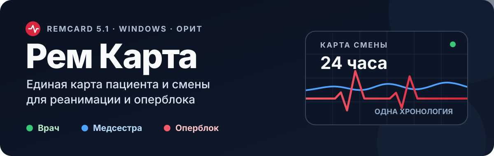
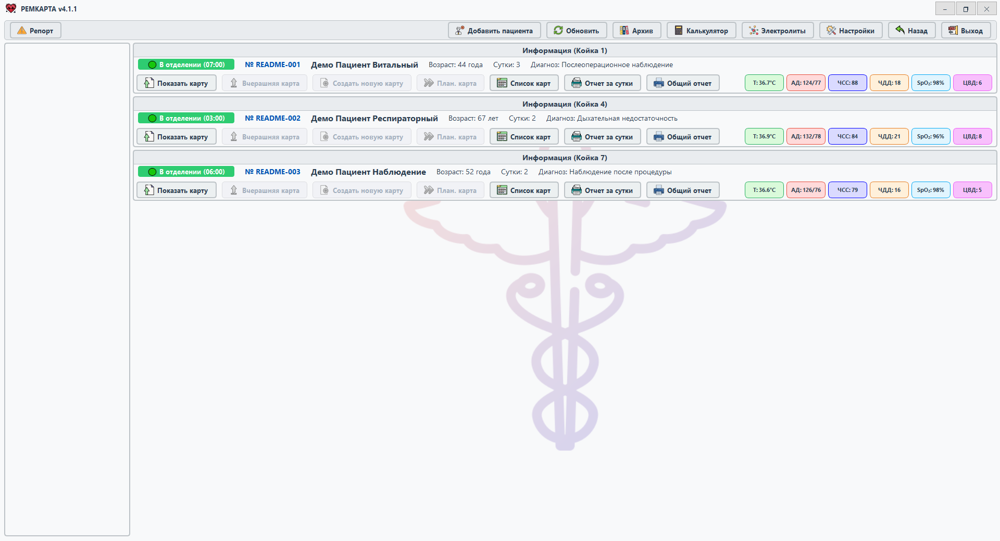
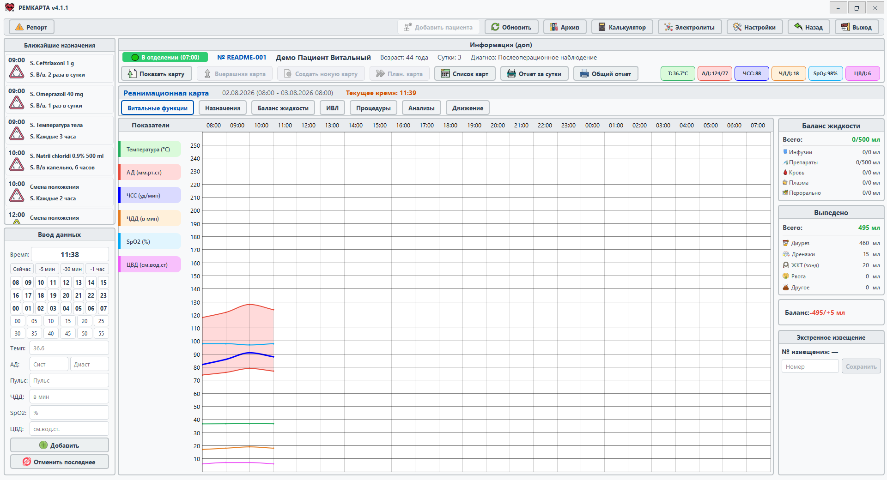
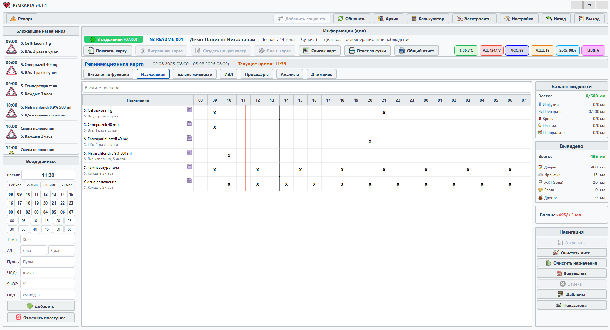
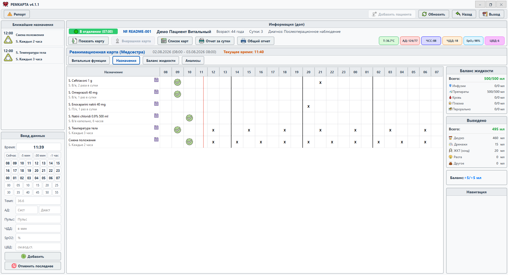
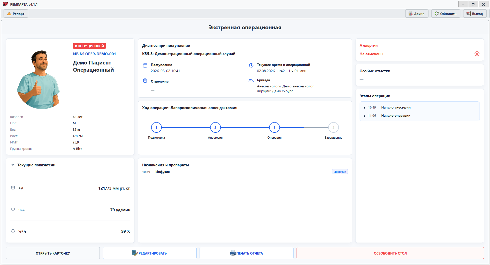
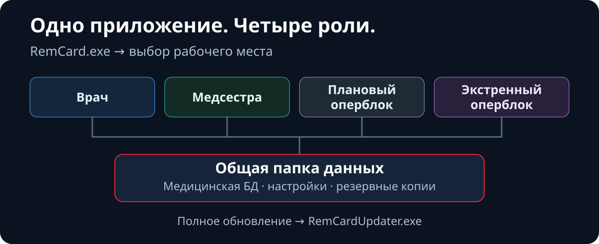

<p align="center">
  
</p>

<p align="center">
  <strong>Windows-приложение для ведения карты пациента и совместной сменной работы в ОРИТ и оперблоке.</strong><br>
  Назначения, витальные показатели, баланс жидкости, ИВЛ, процедуры, анализы, события, отчёты и архив — в одном рабочем контуре.
</p>

<p align="center">
  <code>Версия 4.1.5</code> · <code>Windows</code> · <code>Python 3.11</code> · <code>PySide6</code> · <code>SQLite</code> · <code>MIT</code> · <code>Экспериментальный проект</code>
</p>

<p align="center">
  <a href="#система-в-работе">Интерфейс</a> ·
  <a href="#интерактивная-карта-архитектуры">Архитектура</a> ·
  <a href="#быстрый-запуск-из-исходников">Запуск из исходников</a> ·
  <a href="#установленная-версия-и-обновления">Установка и обновления</a> ·
  <a href="docs/README.md">Документация</a> ·
  <a href="CHANGELOG.md">Изменения</a> ·
  <a href="LICENSE">Лицензия</a>
</p>

> [!WARNING]
> **Рем Карта не является медицинским изделием и не заменяет клинические протоколы, клинические решения или ответственный контроль специалиста.** Для реальной эксплуатации необходимы независимая техническая и клиническая проверка, приёмка в конкретной среде и резервный рабочий процесс.

## Система в работе

Скриншоты ниже сделаны в актуальном RemCard 4.1.1 на синтетических демонстрационных данных; сведения о реальных пациентах не используются.

<p align="center">
  <a href="docs/assets/readme/remcard-real-screenshot.png"></a>
</p>

<p align="center"><em>Активные койки и быстрый переход к карте пациента.</em></p>

<p align="center">
  <a href="docs/assets/readme/remcard-vitals-real-screenshot.png"></a>
</p>

<p align="center"><em>Одна карта смены: витальные функции, назначения, баланс жидкости, ИВЛ, процедуры и анализы.</em></p>

<details>
<summary><strong>Ролевые экраны: врач, медсестра и экстренная операционная</strong></summary>

### Врач — сетка назначений на смену

<p align="center">
  <a href="docs/assets/readme/remcard-doctor-orders-screenshot.png"></a>
</p>

### Медсестра — выполнение назначений

<p align="center">
  <a href="docs/assets/readme/remcard-nurse-orders-screenshot.png"></a>
</p>

### Экстренная операционная — ход случая

<p align="center">
  <a href="docs/assets/readme/remcard-emergency-operating-room-screenshot.png"></a>
</p>

</details>

## Роли в одном рабочем контуре

- **Врач** — госпитализации и койки, карта пациента по сменам, назначения и шаблоны, процедуры, исходы, архив, отчёты и калькуляторы.
- **Медсестра** — ближайшие назначения, отметки о выполнении, сменная динамика, печать и рабочая статистика.
- **Оперблок** — экстренная и плановая операционные, быстрые назначения, препараты, этапы и события операции, завершение случая и отчёты.
- **Администратор** — состояние текущей и архивных БД, резервные копии, настройки, справочники и диагностика.

Дополнительно доступны графики и аналитика, печатные формы, МКБ, темы интерфейса, пользовательские обращения с диагностическими логами и ограниченный локальный режим оперблока при проблемах с сетью.

## Как устроен общий контур

<p align="center">
  <a href="https://donkiton.github.io/rem_card/codemap/codemap.html"></a>
</p>

Интерфейс подтверждает сохранение только после успешной записи в БД. Изменения между рабочими местами передаются через `change_log` и специализированные снимки данных; основной поток — **интерфейс → сервисы → DAO → SQLite**.

## Интерактивная карта архитектуры

<p align="center">
  <a href="https://donkiton.github.io/rem_card/codemap/codemap.html"><strong>Открыть интерактивную карту RemCard →</strong></a><br>
  <sub>20 основных модулей · 40 подтверждённых связей · 5 сквозных потоков</sub>
</p>

Карта дополняет обзорную схему выше технической навигацией по актуальному коду. Нажмите на модуль, чтобы увидеть его входящие и исходящие связи, связанные тесты, исходные пути и подтверждающие символы. Отдельно можно выбирать сквозные сценарии, искать компоненты, фильтровать типы модулей, масштабировать и перетаскивать схему.

Карта полностью выполняется в браузере и не отправляет данные на внешний сервер. Её проверяемые исходные данные доступны в [`codemap.json`](docs/codemap/codemap.json), а автономная HTML-версия — в [`codemap.html`](docs/codemap/codemap.html).

## Быстрый запуск из исходников

Проект разрабатывается и проверяется на **Windows с Python 3.11**. Нужны Git и Python; файл `.env` не требуется.

```powershell
git clone https://github.com/Donkiton/rem_card.git
cd rem_card
py -3.11 -m venv .venv
.\.venv\Scripts\Activate.ps1
python -m pip install --upgrade pip
python -m pip install -r requirements.txt
python launcher.py
```

`launcher.py` не закрепляет роль. При необходимости запустите конкретное рабочее место:

```powershell
python run_doctor.py
python run_nurse.py
python run_operblock_emergency.py
python run_operblock_planned.py
```

> [!CAUTION]
> Для разработки и испытаний используйте отдельную папку данных, а не рабочую production-БД. Dev-сеанс не создаёт и не проверяет файловую блокировку роли: транзакционные блокировки SQLite защищают отдельные записи, но не заменяют изоляцию тестовой среды.

<details>
<summary><strong>Dev-база: выбор и защита от случайной подмены</strong></summary>

Исходная версия использует локальную dev-папку данных; при первом запуске может быть создана недостающая структура. Список выбранных папок и активный путь хранятся отдельно для каждого checkout в `.remcard/dev_database_paths.json`.

Выбранная существующая база открывается с проверкой: приложение не должно незаметно создать пустую БД вместо пропавшей. Старый путь `%LOCALAPPDATA%\RemCard\dev_database_paths.json` используется только для однократного переноса настройки.

</details>

## Установленная версия и обновления

Рабочая Windows-версия распространяется полной папкой PyInstaller, а не MSI или Docker-образом.

| Файл | Назначение |
| --- | --- |
| `RemCardDoctor.exe` | Рабочее место врача. |
| `RemCardNurse.exe` | Рабочее место медсестры. |
| `RemCardOperBlockEmergency.exe` | Экстренная операционная. |
| `RemCardOperBlockPlanned.exe` | Плановая операционная. |
| `RemCardPathSetup.exe` | Выбор общей папки данных. |
| `RemCardUpdater.exe` | Установка полного обновления. |

При первом запуске ролевого EXE выбирается общая папка данных; рядом с программой сохраняется `remcard_data_path.json`. Обновления ищутся в `<папка данных>\UPD\releases`. Проект использует только **полные обновления**: `PATCH` в SemVer описывает уровень версии, а не отдельный формат пакета.

<details>
<summary><strong>Тестовая сборка и безопасная production-публикация</strong></summary>

Непубликуемая сборка текущего рабочего дерева:

```powershell
.\.venv\Scripts\python.exe scripts\build_release.py --test-worktree
```

Она запускает обязательные проверки, PyInstaller и smoke-тест шести EXE, но не меняет `VERSION`, `CHANGELOG.md` или `app/release_info.json`, не создаёт коммит, не выполняет `git push` и не публикует пакет. Результат помечается `TEST_WORKTREE_ONLY.txt`, поэтому не может быть случайно опубликован в production.

Для рабочего релиза версия и точный коммит сначала должны находиться в GitHub `main`; затем менеджер релизов запускает `scripts\build_release.py` с `--expected-version` и `--expected-commit`. После приёмки на изолированной тестовой БД пакет переносится отдельной командой `scripts\publish_full_update.py`. `ready.ok` создаётся последним: после его появления версия сразу доступна клиентам этой базы. Подробности: [сборка и публикация](docs/how_to_build_and_update.md) и [автообновление](docs/auto_update.md).

</details>

## Общая SQLite-БД и безопасность данных

Медицинская БД находится в `archiv/rao_journal.db`, а справочники, темы, фоны и настройки — в `settings/remcard_settings.db`. JSON-файлы репозитория служат начальными данными и слоем совместимости, но не являются рабочим источником истины установленной версии.

Для общей сетевой БД закреплены следующие правила:

- `journal_mode=DELETE`, `synchronous=EXTRA`, `mmap_size=0`; WAL для shared DB запрещён;
- записи проходят через контроллер, файловую блокировку и транзакции;
- живая БД резервируется только через SQLite Backup API, не простым копированием открытого файла;
- для миграций, восстановления и ротации предусмотрены проверенные backup, `quick_check` и `integrity_check`.

Эти меры уменьшают известные риски, но не делают произвольное сетевое размещение SQLite автоматически безопасным. Права доступа, задержки, резервирование и восстановление требуют отдельной эксплуатационной приёмки. Полный контракт: [безопасность БД](docs/db_safety_contract.md).

## Проверки для разработчика

Обычные локальные проверки не должны работать с production-БД:

```powershell
python -m pytest -q
python -m compileall app data services ui scripts
python scripts\code_quality_checks.py
python scripts\architecture_safety_check.py
python scripts\regression_safety_checks.py --profile fast --jobs 4
git diff --check
```

Сетевые стенды, restore drill, аварийный и offline-режимы читают или изменяют выбранную папку данных. Запускайте их только с осознанно заданной тестовой базой по [регламенту приёмки](docs/operational_acceptance.md) и [инструкции проверки резервных копий](docs/backup_restore_drill.md).

## Документы, статус и связь

- [Карта документации](docs/README.md) — действующие регламенты и исторические материалы.
- [Интерактивная карта архитектуры](https://donkiton.github.io/rem_card/codemap/codemap.html) — модули, зависимости, тесты и сквозные потоки с привязкой к исходникам.
- [История изменений](CHANGELOG.md) и [`VERSION`](VERSION) — изменения и текущая версия.
- [Версионность](docs/versioning.md), [автообновление](docs/auto_update.md) и [сборка](docs/how_to_build_and_update.md) — full-release процесс.
- [Контракт безопасности БД](docs/db_safety_contract.md), [эксплуатационная приёмка](docs/operational_acceptance.md) и [аварийная инструкция](docs/emergency_runbook.md) — безопасная эксплуатация.

Проект экспериментальный и активно меняется. Тесты, статические проверки, резервирование и защитные механизмы не заменяют независимый технический, информационно-безопасностный и клинический аудит.

Для сообщений об ошибках и предложений по архитектуре, производительности и безопасной эксплуатации: [menfise@mail.ru](mailto:menfise@mail.ru), тема письма — `РЕМ КАРТА`.

## Лицензия и ответственность

Код распространяется по лицензии [MIT](LICENSE) и предоставляется «как есть». Использование допускается только после самостоятельной оценки рисков и под ответственность пользователя или организации.
