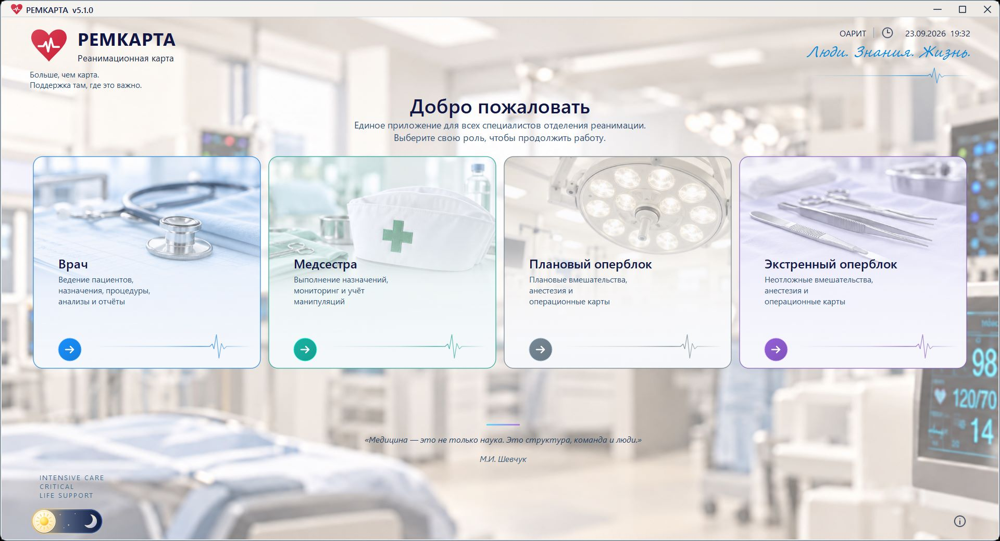
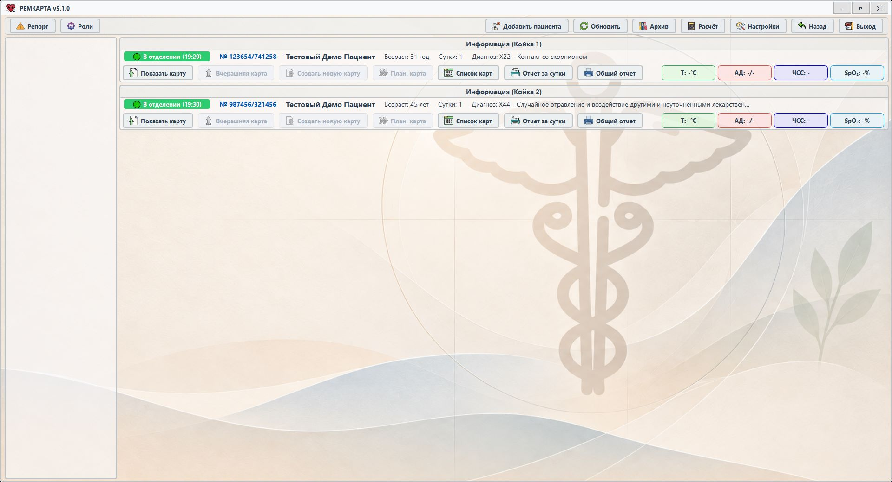
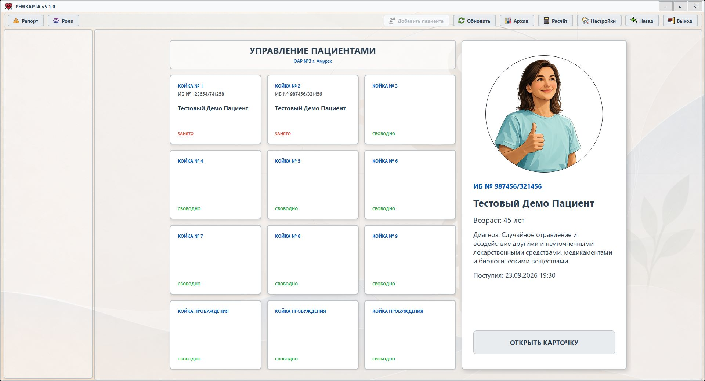
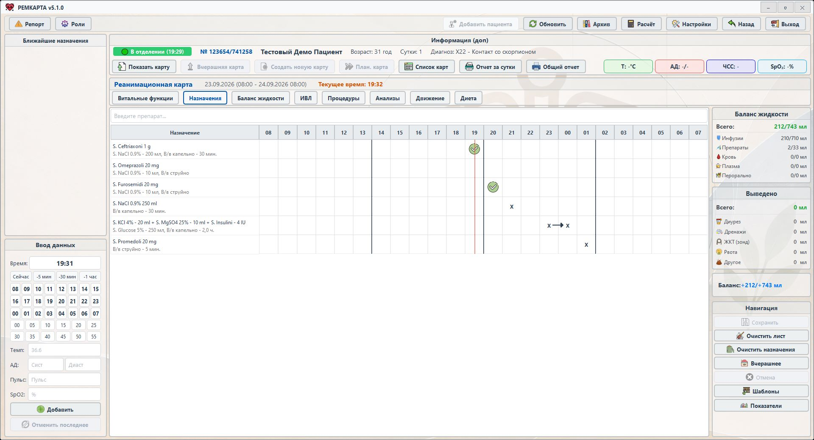
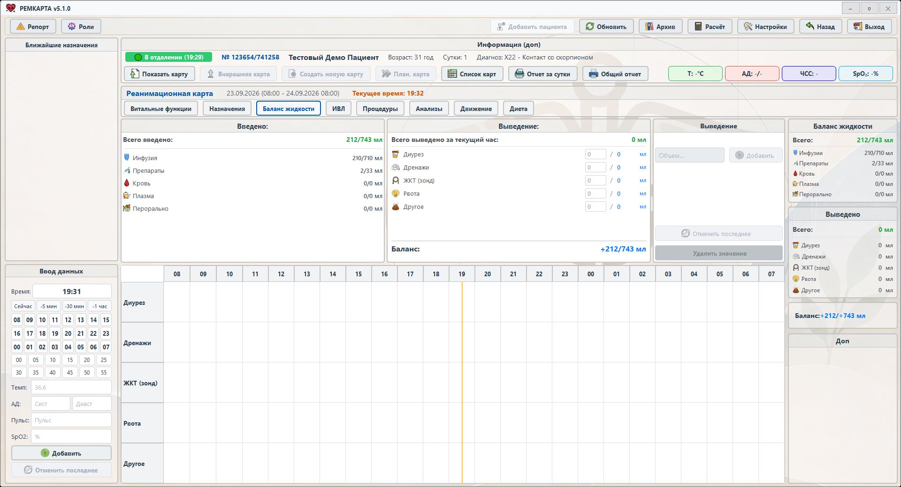

<p align="center">
  
</p>

<h1 align="center">RemCard ICU — электронная реанимационная карта</h1>

<p align="center">
  <strong>RemCard — Windows-приложение для ведения карты пациента и совместной сменной работы в ОРИТ и оперблоке.</strong><br>
  Назначения, витальные показатели, баланс жидкости, ИВЛ, процедуры, анализы, события, отчёты и архив — в одном рабочем контуре.
</p>

<p align="center">
  <code>Версия 5.1.0</code> · <code>Windows</code> · <code>Python 3.11</code> · <code>PySide6</code> · <code>SQLite</code> · <code>RemCard Proprietary Source License</code> · <code>Экспериментальный проект</code>
</p>

<p align="center">
  <a href="#система-в-работе">Интерфейс</a> ·
  <a href="#возможности-текущей-версии">Возможности</a> ·
  <a href="#как-устроен-общий-контур">Архитектура</a> ·
  <a href="#быстрый-запуск-из-исходников">Запуск из исходников</a> ·
  <a href="#установленная-версия-и-обновления">Установка и обновления</a> ·
  <a href="docs/README.md">Документация</a> ·
  <a href="CHANGELOG.md">Изменения</a> ·
  <a href="LICENSE">Лицензия</a>
</p>

Обзор **RemCard 5.1.0**, обновлён **23 сентября 2026 года** по текущему интерфейсу и исходникам. Единый `RemCard.exe` открывает выбор четырёх ролей; отдельный `RemCardUpdater.exe` устанавливает полные обновления. Номер версии исходников указан в [`VERSION`](VERSION), состав конкретной сборки — в её манифесте.

> [!WARNING]
> **Рем Карта не является медицинским изделием и не заменяет клинические протоколы, клинические решения или ответственный контроль специалиста.** Для реальной эксплуатации необходимы независимая техническая и клиническая проверка, приёмка в конкретной среде и резервный рабочий процесс.

## Система в работе

**RemCard 5.1.0**, демонстрационные пациенты. Нажмите на изображение, чтобы открыть его в полном размере.

### Единый вход и выбор роли

[](docs/assets/readme/remcard-roles-5-1.jpg)

Одна программа для четырёх рабочих мест. Кнопка **«Роли»** возвращает к выбору роли; светлая и тёмная темы доступны на экране входа.

### Список пациентов

[](docs/assets/readme/remcard-patients-5-1.jpg)

Активные пациенты по койкам, последние показатели и быстрый переход к карте и отчётам.

<details>
<summary><strong>Управление койками и добавление пациента</strong></summary>

### Управление пациентами

[](docs/assets/readme/remcard-beds-5-1.jpg)

Кнопка **«Добавить пациента»** открывает управление койками. Выберите свободную койку и нажмите «ЗАНЯТЬ КОЙКУ» для оформления поступления. Для занятой койки доступна карточка пациента.

</details>

### Лист назначений

[](docs/assets/readme/remcard-orders-5-1.jpg)

Препараты, способы введения, расписание и отметки выполнения на шкале смены с 08:00 до 08:00 следующего дня.

### Баланс жидкости

[](docs/assets/readme/remcard-balance-5-1.jpg)

Инфузии, препараты, кровь, плазма и пероральное поступление сопоставляются с выведением; рядом доступны почасовая таблица и сводный баланс.

<!-- Новый снимок графиков витальных функций версии 5.1.0 будет добавлен в эту галерею отдельно. -->

## Роли в одном рабочем контуре

- **Врач** — госпитализации и койки, карта пациента по сменам, назначения и шаблоны, назначение диеты, процедуры, исходы, архив, отчёты и калькуляторы.
- **Медсестра** — ближайшие назначения, отметки о выполнении, фактическое потребление питания, сменная динамика, печать и рабочая статистика.
- **Оперблок** — экстренная и плановая операционные, быстрые назначения, препараты, этапы и события операции, передача пациента между РАО и оперблоком, завершение случая и отчёты.
- **Администратор** — единый центр настроек, состояние текущей и архивных БД, резервные копии, справочники, печать, оформление и диагностика.

## Возможности текущей версии

### Единое приложение 5.1

Врач, медсестра, плановый и экстренный оперблок открываются из общего окна. При переходе между ролями приложение завершает принятые записи и освобождает ресурсы предыдущей сессии. Проверка базы и подготовка рабочего места выполняются с отображением состояния; вход можно отменить. Диагностика запуска помогает разбирать задержки открытия приложения и роли.

Настройка папки данных встроена в приложение. Общий режим обслуживания согласует доступ рабочих мест к базе. При недоступности центральной базы аварийный вход проверяет наличие, пригодность и возраст локальной копии; возврат в сетевой режим и перенос изменений выполняются отдельным сценарием.

### Карта пациента и работа смены

Карта объединяет назначения и их выполнение, витальные показатели и графики, введённую и выведенную жидкость, ИВЛ, процедуры, лабораторные анализы и клинические события. Переходы к текущей, вчерашней и плановой картам разделены; история пациента доступна через архив. Для назначений используются справочники препаратов, растворителей и путей введения, шаблоны и расписание на смену.

Во вкладке **«Диета»** врач задаёт план питания и применяет редактируемые шаблоны, а медсестра фиксирует фактическое потребление. Отказ можно сохранить как **0 мл**. Факты питания учитываются в балансе жидкости; собственные изменения можно последовательно отменять. Проверка версии записи защищает от перезаписи изменений другого пользователя.

Предусмотрены документы по процедурам, включая центральный венозный катетер, люмбальную пункцию и гемотрансфузию, а также PDF-отчёты по карте и операционному случаю.

### Калькуляторы и мониторинг ожоговой инфузии

Меню **«Расчёт»** в секторе 8 объединяет калькуляторы инфузии, электролитов и ожогов. Ожоговый калькулятор доступен врачу и медсестре из карты пациента с соответствующим диагнозом МКБ.

Он учитывает возраст, массу, площадь и время травмы, поддерживает первые, вторые и третьи сутки и период после выхода из шока. Из сохранённых данных карты загружаются фактическое введение и диурез; для детских режимов первых и 2–3-х суток учитывается также фактическое энтеральное введение. В окне показаны расчётный период, время мониторинга, остаток объёма и отклонение от расчётного графика. Сутки карты и сутки от момента травмы учитываются раздельно.

Данные загружаются при открытии калькулятора; команда **«Обновить из карты»** перечитывает их с сохранением отмеченных ручных значений. Ошибка чтения не превращается в нулевой объём, а изменение исходных данных очищает прежний результат. Расчёт можно скопировать с пояснениями; назначения автоматически не создаются. Подробные правила и ограничения описаны в [документации калькулятора](docs/burn_infusion_calculator.md).

### Единый архив и аналитика

Центр архива доступен врачу, медсестре и администратору с учётом ролевых возможностей. Он объединяет архив пациентов РАО, архив операционных случаев, аналитику, графики и статистические отчёты. Просмотр карты из архивной БД использует отдельный сервис чтения.

Аналитика позволяет выбрать период и группу пациентов, применить фильтры, сохранить вид и сравнить периоды или группы. Для показателя доступны результат, методика расчёта и список включённых случаев. Общий реестр метрик задаёт единицы, источники и критерии включения; проверка качества данных выявляет дубли и несогласованные значения. Отсутствующие данные сравнения отображаются явно. Расчёты и построение графиков выполняются в фоне; отчёты и графики используют согласованный аналитический снимок.

Определения показателей и границы технической проверки приведены в [контракте аналитики](docs/analytics_clinical_contract.md) и [матрице реализации](docs/analytics_implementation_matrix.md).

### Оперблок, настройки и диагностика

Экстренное и плановое рабочие места ведут операционный случай: бригаду, анестезиологическое пособие, этапы, показатели, препараты и быстрые назначения. Передача пациента из РАО связана с движением пациента и приёмом в операционной. При проблемах с сетью предусмотрен отдельный ограниченный локальный режим оперблока; его данные проходят специальную процедуру переноса после восстановления связи.

Центр настроек объединяет справочники, параметры оперблока, шаблоны питания, каталог анализов, печать, темы, фоны и обслуживание БД. Пользовательские обращения могут включать диагностические логи. Для технических логов действуют ротация, сроки хранения и бюджет объёма; частые штатные метрики сворачиваются в минутные сводки, повторные ошибки — в компактные записи с контекстом. Медицинский аудит изменений хранится отдельно от технических логов и уведомлений синхронизации.

## Как устроен общий контур

<p align="center">
  <a href="https://donkiton.github.io/rem_card/codemap/codemap.html"></a>
</p>

RemCard — настольное приложение на **PySide6** с общей папкой данных. Для штатной работы рабочих мест отдельный веб-сервер не требуется. Основной поток — **интерфейс → сервисы → DAO → SQLite**.

1. **Сохранение.** Интерфейс передаёт изменение в очередь записи. Контроллер получает файловую блокировку и выполняет транзакцию; успешное сохранение подтверждается после `COMMIT` в центральной БД. Черновик или очередь сами по себе не означают, что данные сохранены.
2. **Обновление другого рабочего места.** Триггеры записывают уведомления в `change_log` в той же транзакции. `DataUpdateMonitor` обнаруживает изменения, `SyncCoordinator` сбрасывает устаревшие данные, после чего рабочее место перечитывает нужный снимок. Файлы кэша между компьютерами не передаются.
3. **Быстрое чтение.** `ReadCoordinator`, снимки и локальный кэш ускоряют отображение. Локальная реплика создаётся через SQLite Backup API и служит только для чтения. Если её версия отстаёт от необходимой, чтение переключается на центральную БД. Источником клинической истины остаётся центральная запись после `COMMIT`.
4. **Отзывчивость.** Загрузка снимков, сетевые записи, аналитика и PDF используют фоновые задачи. Поздние результаты проверяются перед применением к открытому пациенту или выбранному периоду.

### Где находится реализация

| Каталог | Ответственность |
| --- | --- |
| [`ui/`](ui/) | Рабочие места врача и медсестры, оперблок, секторы карты, архив, процедуры и настройки интерфейса. |
| [`services/`](services/) | Прикладные операции, расчёты, баланс, питание, координация чтения и синхронизации. |
| [`services/analytics/`](services/analytics/) | Реестр метрик, выборки, когорты, сравнения, статистика и данные графиков. |
| [`data/`](data/) | DAO, модели, справочники и отдельная БД настроек. |
| [`app/`](app/) | Запуск и роли, пути, SQLite-инфраструктура, реплика, резервирование, аварийные режимы, логи и обновления. |
| [`scripts/`](scripts/), [`tests/`](tests/) | Сборка и публикация, CI, проверки качества, автоматические тесты и safety-сценарии. |

Подробный [контракт источника истины и синхронизации](docs/source_of_truth_and_sync_contract.md) описывает границы транзакций, свежесть реплики и правила кэша.

## Интерактивная карта архитектуры

<p align="center">
  <a href="https://donkiton.github.io/rem_card/codemap/codemap.html"><strong>Открыть интерактивную карту RemCard →</strong></a><br>
  <sub>24 основных модуля · 48 подтверждённых связей · 6 сквозных потоков</sub>
</p>

Карта обновлена **23 сентября 2026 года** для архитектуры единого приложения: запуск `run_remcard.py`, выбор роли, допуск к базе, фоновая проверка, завершение сессии, реплика чтения и полное обновление. Это обзор основных компонентов, а не перечень каждого файла; исходный коммит указан на самой карте. Нажмите на модуль, чтобы увидеть его входящие и исходящие связи, связанные тесты, исходные пути и подтверждающие символы. Отдельно можно выбирать сквозные сценарии, искать компоненты, фильтровать типы модулей, масштабировать и перетаскивать схему.

Карта полностью выполняется в браузере и не отправляет данные на внешний сервер. Её проверяемые исходные данные доступны в [`codemap.json`](docs/codemap/codemap.json), а автономная HTML-версия — в [`codemap.html`](docs/codemap/codemap.html).

## Быстрый запуск из исходников

Проект разрабатывается и проверяется на **Windows с Python 3.11**. Нужны Git и Python; файл `.env` не требуется.

```powershell
git clone https://github.com/Donkiton/rem_card.git
cd rem_card
py -3.11 -m venv .venv
.\.venv\Scripts\Activate.ps1
python -m pip install --upgrade pip
python -m pip install -r requirements.txt
python run_remcard.py
```

`run_remcard.py` открывает единое приложение с выбором роли. `launcher.py` и следующие ролевые точки входа сохранены для совместимости и разработки; в пользовательскую сборку отдельные ролевые EXE не входят:

```powershell
python run_doctor.py
python run_nurse.py
python run_operblock_emergency.py
python run_operblock_planned.py
```

> [!CAUTION]
> Для разработки и испытаний используйте отдельную папку данных, а не рабочую production-БД. Блокировки и проверки доступа не заменяют изоляцию тестовой среды. Единая оболочка использует допуск сессии `SessionLease`; поведение старых ролевых точек входа отличается.

<details>
<summary><strong>Dev-база: выбор и защита от случайной подмены</strong></summary>

Исходная версия использует локальную dev-папку данных; при первом запуске может быть создана недостающая структура. Список выбранных папок и активный путь хранятся отдельно для каждого checkout в `.remcard/dev_database_paths.json`.

Выбранная существующая база открывается с проверкой: приложение не должно незаметно создать пустую БД вместо пропавшей. Старый путь `%LOCALAPPDATA%\RemCard\dev_database_paths.json` используется только для однократного переноса настройки.

</details>

## Установленная версия и обновления

Рабочая Windows-версия распространяется полной папкой PyInstaller, а не MSI или Docker-образом.

| Файл | Назначение |
| --- | --- |
| `RemCard.exe` | Единое приложение: выбор роли, рабочие места и настройка папки данных. |
| `RemCardUpdater.exe` | Служебная программа установки полного обновления. |

Запустите **`RemCard.exe`**, выберите папку данных при первом запуске, затем нужную роль. Сохраняйте полную папку поставки вместе с `_internal`: одного EXE недостаточно. Рядом с программой сохраняется `remcard_data_path.json`; обновления ищутся в `<папка данных>\UPD\releases`.

Отдельные `RemCardDoctor.exe`, `RemCardNurse.exe`, EXE оперблока и `RemCardPathSetup.exe` относятся к прежней схеме поставки. В версии 5.1 используется единый вход. Проект распространяет только **полные обновления**: `PATCH` в SemVer обозначает уровень версии, а не отдельный формат пакета.

<details>
<summary><strong>Тестовая сборка и безопасная production-публикация</strong></summary>

Непубликуемая сборка текущего рабочего дерева:

```powershell
.\.venv\Scripts\python.exe scripts\build_release.py --test-worktree
```

Она запускает обязательные проверки, PyInstaller и smoke-тест обоих EXE, но не меняет `VERSION`, `CHANGELOG.md` или `app/release_info.json`, не создаёт коммит, не выполняет `git push` и не публикует пакет. Результат помечается `TEST_WORKTREE_ONLY.txt`, поэтому не может быть случайно опубликован в production.

Для рабочего релиза версия и точный коммит сначала должны находиться в GitHub `main`; затем менеджер релизов запускает `scripts\build_release.py` с `--expected-version` и `--expected-commit`. После приёмки на изолированной тестовой БД пакет переносится отдельной командой `scripts\publish_full_update.py`. `ready.ok` создаётся последним: после его появления версия сразу доступна клиентам этой базы. Подробности: [сборка и публикация](docs/how_to_build_and_update.md) и [автообновление](docs/auto_update.md).

</details>

## Общая SQLite-БД и безопасность данных

Медицинская БД находится в `archiv/rao_journal.db`, а справочники и общие настройки, включая параметры тем и фонов, — в `settings/remcard_settings.db`. Пользовательские фоновые изображения хранятся в `settings/backgrounds`. Пути указаны относительно выбранной папки данных. JSON-файлы справочников в репозитории служат начальными данными и слоем совместимости, но не являются рабочим источником истины установленной версии. Подробности — в [описании БД настроек](docs/settings_db.md).

Для общей сетевой БД закреплены следующие правила:

- `journal_mode=DELETE`, `synchronous=EXTRA`, `mmap_size=0`; WAL для shared DB запрещён;
- записи проходят через контроллер, файловую блокировку и транзакции;
- живая БД резервируется только через SQLite Backup API, не простым копированием открытого файла;
- для миграций, восстановления и ротации предусмотрены проверенные backup, `quick_check` и `integrity_check`.

Эти меры уменьшают известные риски, но не делают произвольное сетевое размещение SQLite автоматически безопасным. Права доступа, задержки, резервирование и восстановление требуют отдельной эксплуатационной приёмки. См. [безопасность БД](docs/db_safety_contract.md) и [контракт источника истины и синхронизации](docs/source_of_truth_and_sync_contract.md).

## Проверки для разработчика

Локальные проверки и GitHub Actions используют единую точку входа. После установки зависимостей в активированном окружении:

```powershell
python scripts\run_ci_checks.py core
python scripts\run_ci_checks.py ui
python scripts\run_ci_checks.py quality
python scripts\run_ci_checks.py regression
git diff --check
```

`core` проверяет логику и данные, `ui` — Qt-интерфейс, `quality` — качество кода и архитектурные ограничения, `regression` — полный реестр safety-сценариев. В CI группы выполняются независимо; итоговый статус `tests` проверяет их успех и полноту отчётов. Модули pytest распределены в [`tests/groups.json`](tests/groups.json) без пропусков и повторений.

Команда `python scripts\run_ci_checks.py all` запускает весь pytest в одном процессе для проверки общей изоляции; она не заменяет отдельные `quality` и `regression`. Runner назначает временные пути БД и QSettings, отчёты сохраняет в `tmp/ci-reports/<группа>`. Для точечной проверки также доступен обычный `python -m pytest tests -q`. Подробнее — [проверки и CI](docs/testing.md).

Сетевые стенды, restore drill, аварийный и offline-режимы читают или изменяют выбранную папку данных. Запускайте их только с осознанно заданной тестовой базой по [регламенту приёмки](docs/operational_acceptance.md) и [инструкции проверки резервных копий](docs/backup_restore_drill.md).

## Документы, статус и связь

- [Карта документации](docs/README.md) — действующие регламенты и исторические материалы.
- [Интерактивная карта архитектуры](https://donkiton.github.io/rem_card/codemap/codemap.html) — модули, зависимости, тесты и сквозные потоки с привязкой к исходникам.
- [История изменений](CHANGELOG.md) и [`VERSION`](VERSION) — изменения и текущая версия.
- [Проверки и CI](docs/testing.md) — группы тестов, изоляция, контроль полноты и отчёты.
- [Ожоговый калькулятор](docs/burn_infusion_calculator.md) и [контракт аналитики](docs/analytics_clinical_contract.md) — расчёты, источники данных и ограничения.
- [Версионность](docs/versioning.md), [автообновление](docs/auto_update.md) и [сборка](docs/how_to_build_and_update.md) — full-release процесс.
- [Контракт безопасности БД](docs/db_safety_contract.md), [источник истины и синхронизация](docs/source_of_truth_and_sync_contract.md), [эксплуатационная приёмка](docs/operational_acceptance.md) и [аварийная инструкция](docs/emergency_runbook.md) — безопасная эксплуатация.

Проект экспериментальный и активно меняется. Тесты, статические проверки, резервирование и защитные механизмы не заменяют независимый технический, информационно-безопасностный и клинический аудит.

Для сообщений об ошибках и предложений по архитектуре, производительности и безопасной эксплуатации: [menfise@mail.ru](mailto:menfise@mail.ru), тема письма — `РЕМ КАРТА`.

## Лицензия и ответственность

Автор концепции, архитектуры, оригинального исходного кода и разработчик RemCard — Битюцкий Вадим Алексеевич (GitHub: [DonKiton](https://github.com/DonKiton)).

RemCard распространяется по [RemCard Proprietary Source License 1.1](LICENSE) с разрешённым некоммерческим использованием физическими лицами. Отдельный пользователь или разработчик может бесплатно смотреть, скачивать, копировать, запускать, изучать и изменять код, а также делиться оригинальной или изменённой версией без получения денег или иной коммерческой выгоды. При распространении необходимо сохранить лицензию и сведения об авторе, указать внесённые изменения, предоставить исходный код и явно обозначить неофициальный статус модификации.

Любое использование организацией либо в интересах работодателя, клиента, бизнеса, клиники или учреждения требует предварительного письменного разрешения правообладателя. Без отдельного соглашения запрещены продажа и перепродажа, платное внедрение, установка, интеграция, доработка, сопровождение, обучение, консультации, хостинг, SaaS, подписка, реклама и иная монетизация. Эти ограничения распространяются на любые производные версии: изменение шрифта, интерфейса, функций, названия или другой части программы не даёт права зарабатывать на ней.

Публичное размещение и fork внутри GitHub не предоставляют коммерческих прав. Программа предоставляется «как есть» и используется на ответственность пользователя. Сторонние библиотеки и зависимости сохраняют собственные лицензии. По классификации OSI это source-available, а не open-source лицензия, поскольку коммерческое использование ограничено. При расхождении этого краткого описания с полным текстом приоритет имеет файл [LICENSE](LICENSE).
