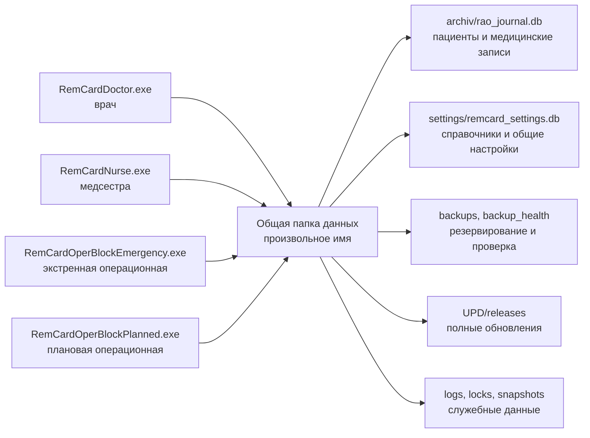

<p align="center">
  
</p>

<h1 align="center">Рем Карта</h1>

<p align="center">
  Windows-приложение для ведения реанимационной карты пациента, сменной работы врача и медсестры, а также рабочих мест оперблока.
</p>

<p align="center">
  
  
  
  
  
  
</p>

<p align="center">
  <a href="VERSION">Версия</a> ·
  <a href="CHANGELOG.md">История изменений</a> ·
  <a href="docs/README.md">Документация</a> ·
  <a href="LICENSE">Лицензия</a>
</p>

> [!WARNING]
> Проект не является медицинским изделием или проверенной системой поддержки клинических решений. Перед любым реальным использованием необходимы независимая проверка, приёмка в конкретной среде, резервный рабочий процесс и ответственный контроль.

## О проекте

`Рем Карта` — настольное приложение для отделения реанимации и интенсивной терапии. Оно объединяет карту пациента, назначения и их выполнение, витальные показатели, баланс жидкости, питание, ИВЛ, анализы, процедуры, события, исходы, печатные формы и архив.

Основные рабочие контуры:

| Контур | Возможности |
|---|---|
| Врач | Активные койки и госпитализации, карта пациента по сменам, назначения и шаблоны, процедуры, исходы, архив, отчёты и калькуляторы. |
| Медсестра | Просмотр назначений, отметки о выполнении, сменная динамика, печать и рабочая статистика. |
| Оперблок | Экстренная и плановая операционные, быстрые назначения, препараты, этапы и события операции, завершение случая, отчёты и ограниченный локальный режим при проблемах с сетью. |
| Общие функции | Управление пациентами и койками, МКБ, аналитика и графики, пользовательские обращения с диагностическими логами, общие справочники, темы, фоны и настройки. |
| Администрирование | Информация о текущей и архивных БД, циклах и резервных копиях, ручные резервные копии, импорт настроек и управление справочниками. |

Врач, медсестра и оперблок работают с общей папкой данных. Интерфейс подтверждает сохранение только после успешной записи в БД, а синхронизация между рабочими местами выполняется по журналу изменений.

## Скриншоты

Изображения сделаны на временных демонстрационных базах с тестовыми данными и не содержат сведений о реальных пациентах.

Главный экран со списком активных пациентов:


Карта пациента на вкладке витальных функций:


## Запуск из исходников

Проект разрабатывается и проверяется на Windows с Python 3.11. Для запуска нужны Git и Python; файл `.env` проекту не требуется.

```powershell
git clone https://github.com/Donkiton/rem_card.git
cd rem_card
py -3.11 -m venv .venv
.\.venv\Scripts\Activate.ps1
python -m pip install --upgrade pip
python -m pip install -r requirements.txt
python launcher.py
```

`launcher.py` запускает приложение без заранее закреплённой роли. Для прямого запуска рабочих мест используются отдельные точки входа:

```powershell
python run_doctor.py
python run_nurse.py
python run_operblock_emergency.py
python run_operblock_planned.py
```

`run_operblock.py` остаётся общей точкой входа оперблока для разработки и диагностики, но отдельный EXE из него не собирается.

### База данных в режиме разработки

По умолчанию исходная версия использует стандартную dev-папку данных в родительском каталоге репозитория. Например:

```text
C:\Project\rem_card                 # репозиторий
C:\Project\<стандартная dev-папка> # dev-БД, логи, настройки и тестовый UPD
```

При первом запуске приложение может создать недостающую локальную структуру. В настройках dev-версии также доступна кнопка «Смена базы»:

- можно сохранить несколько папок и выбрать активную;
- выбор хранится отдельно для каждого checkout в `.remcard/dev_database_paths.json`;
- новая папка применяется после безопасного перезапуска;
- выбранная существующая база проверяется без права незаметно создать пустую БД вместо пропавшего файла;
- старый файл `%LOCALAPPDATA%\RemCard\dev_database_paths.json` используется только для однократного начального переноса настройки.

> [!CAUTION]
> Dev-сеанс не создаёт и не проверяет файловую блокировку роли, поэтому технически может открыться параллельно с установленными клиентами. Для разработки и испытаний используйте отдельную папку данных, а не рабочую production-БД. Транзакционные блокировки SQLite защищают отдельные записи, но не заменяют изоляцию тестовой среды.

## Установленная версия и обновления

В репозитории нет MSI-установщика или Docker-развёртывания. Рабочая Windows-версия распространяется полной папкой PyInstaller с шестью файлами запуска:

- `RemCardDoctor.exe`;
- `RemCardNurse.exe`;
- `RemCardOperBlockEmergency.exe`;
- `RemCardOperBlockPlanned.exe`;
- `RemCardPathSetup.exe`;
- `RemCardUpdater.exe`.

Папку программы можно разместить на любом локальном диске. При первом запуске любого ролевого EXE программа просит выбрать общую папку данных с произвольным именем, создаёт в ней необходимую структуру и сохраняет рядом с EXE файл `remcard_data_path.json`. `RemCardPathSetup.exe` остаётся для последующей ручной смены пути; обновления ищутся в `<выбранная папка данных>\UPD\releases`.

Проект использует только полные обновления. Уровень `PATCH` в SemVer означает размер изменения версии, а не отдельный формат пакета. Установленный клиент проверяет обновление перед обычным запуском и после штатного закрытия. При обновлении на старте затем снова открывается тот же EXE; после закрытия программа не перезапускается.

### Безопасная тестовая сборка текущих изменений

Чтобы проверить собранную программу до рабочего коммита и релиза, в том числе при незакоммиченных изменениях, используется:

```powershell
.\.venv\Scripts\python.exe scripts\build_release.py --test-worktree
```

Команда запускает обязательные проверки, PyInstaller и smoke-тест всех шести EXE, но:

- не меняет `VERSION`, `CHANGELOG.md` и `app/release_info.json`;
- не создаёт коммит и не выполняет `git push`;
- не публикует пакет в `UPD` и не создаёт `ready.ok`;
- сохраняет проверенный результат в `dist\Prog` с маркером `TEST_WORKTREE_ONLY.txt`.

`publish_full_update.py` отклоняет такой тестовый пакет, поэтому его нельзя случайно выдать рабочим клиентам.

### Рабочий релиз

Обычная релизная команда запускается только из чистого, заранее закоммиченного рабочего дерева:

```powershell
.\.venv\Scripts\python.exe scripts\build_release.py
```

Скрипт формирует версию и журнал изменений, создаёт русский release-коммит, выполняет обязательные проверки, собирает и проверяет все EXE, отправляет точный release-коммит в `origin` и только после успешного push помещает пакет в локальный тестовый `UPD`. Временные `build` и `dist` после обычной релизной сборки очищаются.

Затем пакет принимается на отдельной тестовой БД и только после этого явно переносится в сетевую рабочую базу:

```powershell
.\.venv\Scripts\python.exe scripts\publish_full_update.py `
  --source "<локальная папка данных>\UPD\releases\<проверенная версия>" `
  --config "<папка установленной программы>\remcard_data_path.json"
```

Publisher повторно проверяет пакет и наличие исходного коммита в `origin`, поддерживает возобновляемое копирование и создаёт `ready.ok` последним.

> [!IMPORTANT]
> После появления `ready.ok` в рабочем сетевом каталоге версия сразу доступна всем клиентам этой базы. Проверка «сначала на одном рабочем компьютере» должна быть завершена на изолированной тестовой базе до публикации.

Полный порядок описан в [инструкции по сборке и публикации](docs/how_to_build_and_update.md) и [документации автообновления](docs/auto_update.md).

## Архитектура и хранение данных



Основной поток внутри приложения: интерфейс → сервисы → DAO → SQLite. Тяжёлые чтения, аналитика и построение PDF по возможности выполняются в рабочих потоках, а изменения между клиентами передаются через `change_log` и специализированные снимки данных.

Основная медицинская БД хранится в `archiv/rao_journal.db`. Общие справочники, темы, фоны и настройки вынесены в `settings/remcard_settings.db`; JSON-файлы репозитория служат начальными данными и совместимостью, но не являются рабочим источником истины установленной версии.

Для сетевой SQLite-БД проект закрепляет профиль:

- `journal_mode=DELETE`;
- `synchronous=EXTRA`;
- `mmap_size=0`;
- запись через блокировки, очередь и транзакции;
- резервное копирование через SQLite Backup API, без простого копирования открытого файла БД;
- проверки запуска, миграций, целостности, старых клиентов и восстановления.

Эти механизмы снижают известные риски проекта, но не делают произвольное сетевое размещение SQLite автоматически безопасным. Конкретная сетевая папка, права, задержки, резервирование и сценарии восстановления требуют отдельной эксплуатационной приёмки.

## Структура репозитория

| Путь | Назначение |
|---|---|
| `launcher.py`, `run_*.py` | Запуск из исходников и точки входа ролей. |
| `app/` | Запуск, роли, пути, жизненный цикл БД, аварийный режим, резервирование и обновления. |
| `data/dao/` | Доступ к медицинской БД: пациенты, назначения, витальные показатели, баланс, статусы, ИВЛ, процедуры и анализы. |
| `data/dto/` | Объекты передачи данных между слоями. |
| `data/settings/` | Схема, импорт и release snapshot центральной БД настроек. |
| `services/` | Бизнес-логика, координация чтения и записи, отчёты, аналитика, оперблок и пользовательские обращения. |
| `ui/` | Интерфейс врача, медсестры, оперблока, карты пациента, процедур, аналитики, общих компонентов и тем. |
| `standalone/` | Вспомогательные изолированные приложения и точки запуска. |
| `scripts/` | Проверки, тестовые стенды, диагностика, сборка, публикация, резервирование и восстановление. |
| `tests/` | Набор тестов `pytest`, включая регрессии назначений, БД, интерфейса и release-процесса. |
| `docs/` | Действующие регламенты, отчёты, планы и исторические архитектурные снимки. |
| `settings/` | Начальные и резервные настройки интерфейса; рабочие настройки установленной версии находятся в settings DB. |
| `icon/`, `procedure_templates/` | Графические ресурсы и шаблоны процедур. |
| `rem_card/`, `_local_rem_card_bootstrap.py` | Небольшой source-shim, позволяющий импортировать checkout как пакет `rem_card`. |
| `RemCard.spec` | Описание полной onedir-сборки PyInstaller. |
| `VERSION`, `CHANGELOG.md` | Текущая версия и журнал изменений. |

## Проверки

Обычные локальные проверки, которые не должны работать с production-БД:

```powershell
python -m pytest -q
python -m compileall app data services ui scripts
python scripts\code_quality_checks.py
python scripts\architecture_safety_check.py
python scripts\regression_safety_checks.py
git diff --check
```

Релизный скрипт самостоятельно запускает установленный обязательный набор проверок и smoke всех шести собранных EXE.

Сетевые стенды, проверка и перемещение повреждённых резервных копий, restore drill, аварийный режим и offline-режим оперблока являются отдельными операционными проверками. Они читают или изменяют файлы выбранной папки данных, поэтому должны запускаться только с осознанно заданной тестовой базой по [регламенту приёмки](docs/operational_acceptance.md) и [инструкции проверки резервных копий](docs/backup_restore_drill.md).

Для чисто документационных изменений достаточно проверить Markdown, локальные ссылки и выполнить `git diff --check`.

## Документация

- [Карта документации](docs/README.md) — действующие регламенты и исторические материалы.
- [История изменений](CHANGELOG.md) — пользовательские и технические изменения по версиям.
- [Версионность](docs/versioning.md) — SemVer, changelog и release-коммит.
- [Сборка и публикация](docs/how_to_build_and_update.md) — пошаговый рабочий процесс владельца проекта.
- [Автообновление](docs/auto_update.md) — формат полного пакета, проверка, установка и rollback.
- [Контракт безопасности БД](docs/db_safety_contract.md) — обязательные инварианты SQLite, миграций и recovery.
- [Центральная БД настроек](docs/settings_db.md) — справочники, настройки и release snapshot.
- [Эксплуатационная приёмка](docs/operational_acceptance.md) — обязательные и профильные проверки.
- [Аварийная инструкция](docs/emergency_runbook.md) — действия при недоступной или занятой БД.
- [План развития updater](docs/updater_optimization_plan.md) — выполненные пункты и оставшиеся эксплуатационные задачи.

## Статус и ограничения

Проект экспериментальный и активно меняется. Актуальную версию следует смотреть в [`VERSION`](VERSION), изменения — в [`CHANGELOG.md`](CHANGELOG.md), а текущее состояние кода — в ветке, выбранной на GitHub по умолчанию; имя ветки намеренно не фиксируется здесь, чтобы README не устаревал при её смене.

Это первый крупный программный проект автора, который развивается при активной помощи AI-инструментов. В коде остаются архитектурные компромиссы, сложные legacy-участки и технический долг. Репозиторий содержит тесты, статические проверки, регламенты резервирования и защитные механизмы, но они не заменяют независимый технический, информационно-безопасностный и клинический аудит.

## Связь и помощь проекту

Сообщения об ошибках, предложения по архитектуре, производительности и безопасной эксплуатации приветствуются. Связаться с автором можно по адресу [menfise@mail.ru](mailto:menfise@mail.ru), тема письма — `РЕМ КАРТА`.

Особенно полезна помощь специалистов, которые могут улучшить проект для реальной работы отделения реанимации, не нарушив логику данных, миграций и существующих рабочих процессов.

## Лицензия и ответственность

Код распространяется по лицензии [MIT](LICENSE).

Проект предоставляется «как есть». Автор не несёт ответственности за потерю данных, повреждение БД, неверное поведение приложения, ошибочные решения или другой ущерб. Использование допускается только после самостоятельной оценки рисков и под ответственность пользователя или организации.

Разработчикам следует относиться к репозиторию как к большому экспериментальному Windows-проекту, а не как к эталонной production-архитектуре. Пользователям нельзя полагаться на приложение при принятии медицинских решений без независимой проверки, тестирования и резервного процесса.
